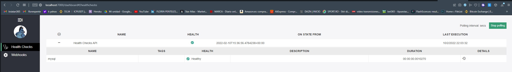

#  Proyecto Trading 

El proyecto de Trading es un proyecto realizado durante el Bootcamp de .Net.

El proyecto está formado por un conjunto de soluciones que tienen como finalidad la posibilidad de mantener actualizadas tanto las acciones que un usuario compra, como la base de datos de las mismas actualizandose a través de una Api pública que proporciona los datos.

El proyecto empezó por una clase donde creabamos a mano una acción ficticia y la imprimiamos por consola, y según avanzaba el curso de formación se han ido incorporando arquitecturas, patrones de diseño, herramientas y muchas otras características.

# Aplicaciones
El proyecto está formado por 2 aplicaciones para asegurar la trazabilidad e integridad de todos los datos tratados.

- **Trading.Web.Api** La primera aplicación desarrollada se encarga de mantener actualizados y disponibles los datos de las acciones. 
-  **Trading.App.Client** La segunda aplicación se encarga de mostrar al usuario final la interfaz para interactuar con la Api y realizar acciones.

# Diseño de las Aplicaciones  
## Architectura
La Arquitectura utilizada para el desarrollo de las aplicaciones es **Domain-Driven Design** que es un conjunto de patrones principios y prácticas que nos ayudan a entender y resolver los problemas del negocio en el diseño de sistemas orientados a objetos.
 


# Tech Stack
### Tecnologías utilizadas en la **Trading.Web.Api**
- ASP.NET Core 5.0
- ASP.NET Web Api
- AutoMapper
- Swagger UI
- MYSQL
- Docker-Compose
- HttpClient
- Entity Framework
- Linq
- HealthCheck
  
### Patrones de diseño y SOLID principles
- Unit Of Work
- Middleware
- Dependency injection
- Repository Pattern
- Singleton

### Seguridad
- CORS
- XSS 
- Remove Headers
- Fluent Validations

### Tecnologías utilizadas en la **Trading.Web.Cliente**

- ASP.NET Core 5.0
- ASP.NET Core MVC
- Docker-Compose
- ASP.NET MVC-Razor
- AutoMapper
- Serilog
- Linq
- Paginado

# Pre-requisitos globales

- Tener instalado el Visual Studio 2022 con la version .Net 5.0

- Tener instalado el MySql Workbench 8.0

- Tener instalado Docker Desktop

- Disponer de una tarjeta de credito para conseguir el **AddOn de Heroku**

# Instalación 🔧 

En cada aplicación se indican los pasos a seguir para la correcta puesta en marcha del proyecto.
Recomendable configurar primero la Web Api así disponer de los datos primero.

1) Ver [Trading.Web.Api/README.md](https://github.com/florinawer/trading/blob/master/TradingApp/README.md)
2) Ver [Trading.Web.Api.Client/README.md](https://github.com/florinawer/trading/tree/master/TradingAppClient#readme)

# Deploy con Docker-Compose 📦 

La configuración del deploy con **docker-compose** se realiza en la configuración general del proyecto porque engloba todas las aplicaciones.

En primer lugar hay que crear una conexión a MySql Workbench y modificar el archivo **appsetings.json** con la información de la nueva conexión.
Si el servidor tiene usuario y password es necesario incluirlos en el campo de la siguiente manera:
```
Server=(Nombre del servidor);Database=(Nombre de la base de datos creada);uid=(Usuario necesario para acceder al servidor); Password=(contraseña para acceder al servidor)
```


# Configuración

- Crear el fichero *docker-compose.yml* donde se  configuran los contenedores a crear y sus dependencias

- Indicar en la nueva conexión a MySql, en el archivo *docker-compose.yml* y en el fichero *appsettings.json* los mismos valores y parametros.

# Ejecución

- Abrir una consola desde el directorio donde se encuentra el archivo de configuración *docker-compose.yml* 

- Ejecutar **docker-compose build** para compilación

- Ejecutar **docker-compose up** para levantar los contenedores 

- Desde la interfaz de docker se lanza un navegador para acceder a la dirección localhost seguida de los puertos indicados en *docker-compose.yml*.


## Asp.Net Cliente MVC
- http://localhost:7001 - para ver la aplicación cliente mvc

## Web Api Swagger 
- http://localhost:7000/swagger/index.html - para ver la WebApi con swagger

## Health check
- http://localhost:7000/dashboard - para ver el estado de **health** de la Api
  
  

# TODO
- [x] Transaction (Unit of Work)
- [x] Validation (FluentValidation)
- [x] Response wrapper
- [x] XSS injection
- [x] Async/Await
- [x] REST
- [x] Mapping (AutoMapper)
- [x] RemoveHeader
- [x] API Specification, API Definition (Swagger)
- [x] Middleware
- [x] CORS
- [x] Pagination
- [x] Error Handling, Global Exception
- [x] HealthCheck
- [ ] RabbitMQ
- [ ] serilog gmail
- [ ] enviroment variables
- [ ] Unit Testing
- [x] Common: Constants, Helpers
- [ ] Authentication Api with CQRS
- [x] Docker
- [x] Scoped over Transient
- [x] Use `abstract` keyword to appropriate class
- [x] Use `IQueryable`, `IEnumerable`, `IList` interfaces
- [x] Migration, Scaffold
- [ ] Logging
- [ ] Microservices, API Gateway
- [ ] API Versioning
- [x] API Versioning with Swagger
- [ ] File storage: Upload/Download
- [x] Kestrel
- [ ] Task scheduling & Queues
- [x] BulkInsert, BulkUpdate

# References 📖 

* [.Net Framework](https://docs.microsoft.com/es-es/dotnet/framework/get-started/)
* [Inserción de Dependencias](https://docs.microsoft.com/es-es/aspnet/core/fundamentals/dependency-injection?view=aspnetcore-6.0)
* [Middleware de ASP.NET Core](https://docs.microsoft.com/es-es/aspnet/core/fundamentals/middleware/?view=aspnetcore-6.0) 

* [Configuración en ASP.NET Core](https://docs.microsoft.com/es-es/aspnet/core/fundamentals/configuration/?view=aspnetcore-6.0)
* [Enrutamiento en ASP.NET Core](https://docs.microsoft.com/es-es/aspnet/core/fundamentals/routing?view=aspnetcore-6.0)
* [Controlar errores en ASP.NET Core](https://docs.microsoft.com/es-es/aspnet/core/fundamentals/error-handling?view=aspnetcore-6.0)
* [HttpRequest](https://docs.microsoft.com/es-es/aspnet/core/fundamentals/http-requests?view=aspnetcore-6.0)