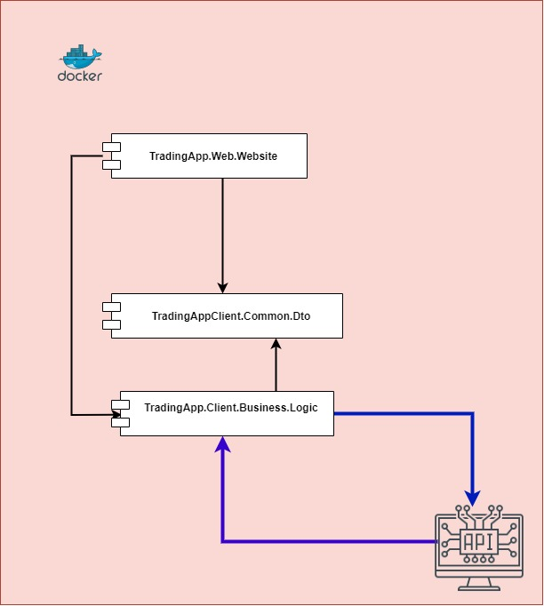
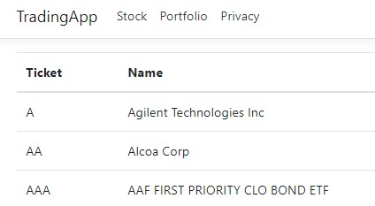

# Trading.App.Cliente
Aplicación que permite al usuario final interactuar con el contenido de la base de datos, tanto como ver precios actuales como comprar acciones, visualizar o modificar su portfolio adquirido.

Diagrama de componentes de la aplicación Trading.App.Cliente


 
# Instrucciones para iniciar Trading.App.Cliente

A continuacion se presenta las instrucciones necesarias para poner en funcionamiento Trading.App.Cliente.

# Pre-requisitos

- Tener instalado el **Visual Studio** 2022 con la version .Net 5.0

- Tener instalado **Docker Desktop** (para despliegue con docker-compose)

# Instalación 🔧

1) Descargar el proyecto y abrir en Visual Studio 2022

2) Realizar un compilado. Presionar con el click derecho sobre el solution del proyecto dentro del Visual Studio y ejecutar la opcion **Build Solution**.
   Esto se hace para verificar que el código compila correctamente y que las dependencias se instale correctamente.

# Descripción del funcionamiento
La aplicación se conecta a la Api de Trading.Web.Api modificando en el archivo **appsetings.json** la dirección de acceso a la Api.

En los controladores de acciones y portfolio personal, se importan los datos paginados de la Api y se muestran por pantalla.



# Deploy 📦
## Deploy en Heroku
Pasos a seguir para el correcto despliegue en **Heroku**:

Fase 1:
- Dirigirse a https://dashboard.heroku.com/apps
- Crear una aplicación nueva desde la web eligiendo la región mas cercana
- En la sección de **Deployment method** elegir **Container Registry**
- Agregar el AddOn de **web** en la tienda de **Geroku**
- Modificar el archivo **appsetings.json** de igual manera que para servidor en local con la información obtenida del perfil de **Heroku**

Fase 2:
-  Desde el directorio de la aplicación donde se encuentra el archivo **DockerFile** que se ha generado al crear la **web.Client** abrimos una terminal
-  Ejecutamos el primer comando después de lanzar la aplicación **docker desktop** que hemos instalado anteriormente.
Al lanzar el comando de **Login de Heroku** se abre un navegador para completar la autenticación hacia la cuenta creada.
```
 heroku login
```
- Segundo comando es el login de contenedor para registro.
```
 heroku container: login
```
- Importante que el nombre de la aplicación sea el mismo que en la web de **Heroku**. Construye la imagen en docker y la sube a Heroku.
```
 heroku container: push **NombreAppEnHeroku** web
```
- Último comando publica la aplicación y la hace accesible.
```
 heroku container: release **NombreAppEnHeroku** web
```
Deploy de la Web.Api en **Heroku**:
- https://tradingwebapiappcliente.herokuapp.com


# Principales caracteristicas de la Trading.Web.Cliente

## Paginado de la Trading.Web.Cliente
- Implementación de paginado que apunta a la Web.Api mandandole la información con los resultados que quiere que le devuelva. Un ejemplo sería el número de la página y los elementos por página.

```
{
  public async Task<PagedResponseDto<IEnumerable<StockDTO>>> GetAll(PaginationFilterDto paginationFilter) 
        {
            var httpResponse = await _httpClient.GetFromJsonAsync<PagedResponseDto<IEnumerable<StockDTO>>>
                ($"/api/Stock/Paged?pageNumber={paginationFilter.PageNumber}&pageSize={paginationFilter.PageSize}");
            
            return httpResponse;
        }
```
- Implementación de **Automapper** para el mapeo de objetos.

```
private static MapperConfiguration GetMapperConfiguration()
        {
            return new(mapperConfiguration =>
            {                
                mapperConfiguration
                    .CreateMap<StockDTO, StockViewModel>()
                    .ReverseMap();        
            });
        }
```
- Eliminado de información sensible de las cabeceras de las peticiones.
```
 public static IHostBuilder CreateHostBuilder(string[] args) =>
        Host.CreateDefaultBuilder(args)
            .ConfigureWebHostDefaults(webBuilder =>
            {
                webBuilder.UseStartup<Startup>();
                webBuilder.UseKestrel(options => options.AddServerHeader = false);
            });
```

# Wiki 📖

* [.Net Framework](https://docs.microsoft.com/es-es/dotnet/framework/get-started/)
* [Inserción de Dependencias](https://docs.microsoft.com/es-es/aspnet/core/fundamentals/dependency-injection?view=aspnetcore-6.0)
* [Middleware de ASP.NET Core](https://docs.microsoft.com/es-es/aspnet/core/fundamentals/middleware/?view=aspnetcore-6.0) 

* [Configuración en ASP.NET Core](https://docs.microsoft.com/es-es/aspnet/core/fundamentals/configuration/?view=aspnetcore-6.0)
* [Enrutamiento en ASP.NET Core](https://docs.microsoft.com/es-es/aspnet/core/fundamentals/routing?view=aspnetcore-6.0)
* [Controlar errores en ASP.NET Core](https://docs.microsoft.com/es-es/aspnet/core/fundamentals/error-handling?view=aspnetcore-6.0)
* [HttpRequest](https://docs.microsoft.com/es-es/aspnet/core/fundamentals/http-requests?view=aspnetcore-6.0)

  